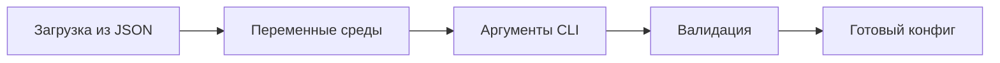

# NetConfigus: Универсальный конфигурационный менеджер для .NET


**NetConfigus** — продвинутая библиотека для управления конфигурацией приложений .NET, объединяющая параметры командной строки, переменные среды и JSON-файлы в единую систему с четкой приоритезацией источников.

## 🌟 Ключевые особенности

- **Мультиисточниковость**: Объединение конфигурации из трех источников:
  1. Аргументы командной строки (наивысший приоритет)
  2. Переменные среды
  3. JSON-файлы конфигурации
- **Гибкий парсинг**:
  - Позиционные (`app.exe file.txt`)
  - Именованные (`--output=result.json`)
  - Комбинированные флаги (`-ab`)
  - Пустые значения (`-c=`)
- **Автоматическая конвертация типов**: `int`, `bool`, `double`, `string`, массивы
- **Валидация конфигурации**: Обязательные параметры, проверка конфликтов
- **Поддержка массивов**: Множественные объявления параметров
- **Кросс-платформенность**: Работает на любой ОС с .NET 5+

## ⚙️ Установка

Добавьте пакет через NuGet:
```bash
dotnet add package NetConfigus
```

Или укажите в .csproj:
```xml
<PackageReference Include="NetConfigus" Version="1.0.0" />
```

## 🚀 Быстрый старт

1. Определите класс конфигурации:
```csharp
public class AppConfig
{
    [CommandLine(Position = 0, Required = true)]
    public string Source { get; set; } = default!;

    [CommandLine(ShortName = 't', EnvironmentVariableName = "APP_THREADS")]
    public int Threads { get; set; } = 1;

    [CommandLine(LongName = "verbose")]
    public bool Verbose { get; set; }
}
```

2. Загрузите конфигурацию:
```csharp
var config = CommandLineParser.Load<AppConfig>(
    "config.json",          // Путь к JSON-файлу
    Environment.GetCommandLineArgs()[1..], // Аргументы
    isConfigFileRequired: false
);
```

3. Используйте:
```csharp
Console.WriteLine($"Processing {config.Source} with {config.Threads} threads");
if (config.Verbose) Console.WriteLine("Verbose mode enabled");
```

## 📚 Документация

### Атрибут `CommandLineAttribute`

| Свойство                  | Описание                              | По умолчанию   |
|---------------------------|---------------------------------------|----------------|
| `ShortName` (char)        | Краткое имя параметра (`-v`)          | `'\0'`         |
| `LongName` (string)       | Полное имя параметра (`--verbose`)    | `null`         |
| `Description` (string)    | Описание для справки                  | `null`         |
| `EnvironmentVariableName` | Имя переменной среды                  | `null`         |
| `Required` (bool)         | Обязательность параметра              | `false`        |
| `Position` (int)          | Позиция аргумента (0-based)           | `-1` (не задан)|

### Методы `CommandLineParser`

#### `Load<T>(string? fn, string[]? args, bool isConfigFileRequired = false)`
Загружает конфигурацию из нескольких источников.

**Параметры:**
- `fn`: Путь к JSON-файлу конфигурации
- `args`: Аргументы командной строки
- `isConfigFileRequired`: Выбрасывать исключение если файл не найден

#### `Parse<T>(T options, string[] args)`
Парсит только аргументы командной строки.

## 🧪 Примеры использования

### Комбинированные флаги
```csharp
public class Flags {
    [CommandLine(ShortName = 'a')] public bool A { get; set; }
    [CommandLine(ShortName = 'b')] public bool B { get; set; }
}

// Использование: app -ab
// Результат: A=true, B=true
```

### Работа с массивами
```csharp
public class LogConfig {
    [CommandLine(ShortName = 'l')]
    public string[] Logs { get; set; } = [];
}

// Использование: app -l=error -l=debug
// Результат: Logs = ["error", "debug"]
```

### Переопределение через окружение
```json
// config.json
{ "ApiKey": "default-key" }
```

```csharp
public class ServiceConfig {
    [CommandLine(EnvironmentVariableName = "API_KEY")]
    public string ApiKey { get; set; } = default!;
}

// При наличии переменной среды API_KEY=prod-key
// Результат: ApiKey = "prod-key"
```

## ⚠️ Ограничения
- Поддерживаемые типы: `string`, `int`, `bool`, `double`, массивы
- Булевы параметры не могут быть позиционными
- Не поддерживаются вложенные объекты конфигурации

## 📜 Лицензия
Проект распространяется под лицензией MIT. Полный текст лицензии доступен в файле [LICENSE](LICENSE).

## 👤 Автор
**virst**  
[GitHub профиль](https://github.com/virst)

---



> NetConfigus упрощает жизнь разработчика, предоставляя единый интерфейс для работы с разными источниками конфигурации с минимальным количеством кода.